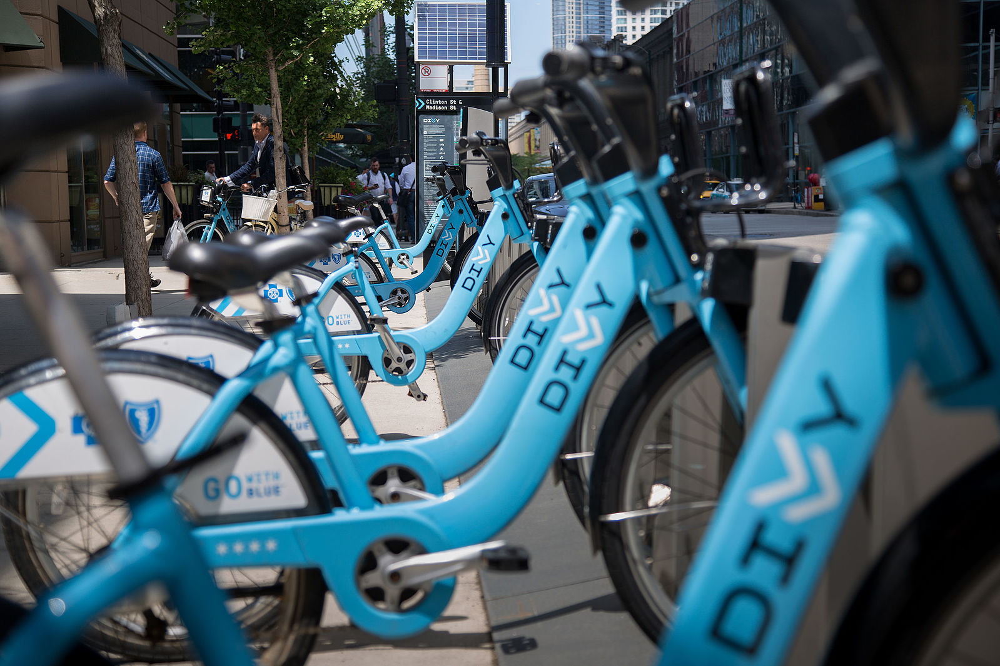

# Bike Share Analysis

## Introduction
This is the first project in udacity **Data Analysis Professional Track** which we study how to use python in data analysis.

## Overview
In this project, we explore data related to :bike: bike share systems for three major cities in the United States Chicago, New York City, and Washington.
and provide an interactive experience in the terminal to help answering intersting questions about it by computing descriptive statistics.

## Files
As you can find in this repository 3 csv files which include a cleaned version of bike share data for 3 cities:
* Chicago.
* New York City.
* Washington.

And Bikeshare Final Project.py file which include the script for the program.

## How to use
Simply run the script in ur terminal using `python Bikeshare Final Project.py` and follow the instructions.

#### Find me in social media

 
